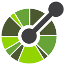

<article class="markdown-body entry-content container-lg f5 " itemprop="text">
  <h2 dir="auto" id="top">
    <a id="user-content-hi-there-" class="anchor" aria-hidden="true" tabindex="-1" href="#top">
      <svg class="octicon octicon-link" viewBox="0 0 16 16" version="1.1" width="16" height="16" aria-hidden="true"><path d="m7.775 3.275 1.25-1.25a3.5 3.5 0 1 1 4.95 4.95l-2.5 2.5a3.5 3.5 0 0 1-4.95 0 .751.751 0 0 1 .018-1.042.751.751 0 0 1 1.042-.018 1.998 1.998 0 0 0 2.83 0l2.5-2.5a2.002 2.002 0 0 0-2.83-2.83l-1.25 1.25a.751.751 0 0 1-1.042-.018.751.751 0 0 1-.018-1.042Zm-4.69 9.64a1.998 1.998 0 0 0 2.83 0l1.25-1.25a.751.751 0 0 1 1.042.018.751.751 0 0 1 .018 1.042l-1.25 1.25a3.5 3.5 0 1 1-4.95-4.95l2.5-2.5a3.5 3.5 0 0 1 4.95 0 .751.751 0 0 1-.018 1.042.751.751 0 0 1-1.042.018 1.998 1.998 0 0 0-2.83 0l-2.5 2.5a1.998 1.998 0 0 0 0 2.83Z"></path></svg>
      <strong>🚀 Engenheiro de Software | Especialista em Frontend | Desenvolvimento Full-Stack</strong>
    </a>
  </h2>

  

    Olá! Sou Fernando, um engenheiro de software apaixonado por tecnologia e focado em resultados, com mais de 5 anos de experiência em desenvolvimento full-stack.
  

  

    Minha especialidade está no desenvolvimento Frontend nativo (HTML5, CSS3, JavaScript, TypeScript) e tenho experiência Pleno em Angular e Júnior em Java/Spring Boot, criando aplicações escaláveis e de alto desempenho. Além disso, possuo conhecimento sólido em bancos de dados como PostgreSQL, MySQL, SQL Server e Oracle.
  

  
  
    Tenho expertise no desenvolvimento de ponta a ponta, aplicando boas práticas, padrões de design e metodologias ágeis (Scrum/Agile) para entregar soluções eficientes e inovadoras. Minha capacidade de adaptação e aprendizado rápido me permite enfrentar desafios complexos e impulsionar melhorias contínuas nos projetos em que atuo.
  

  
  
    📩 Contato: <a href="mailto:fernandoarag@gmail.com">fernandoarag@gmail.com</a>
  

   

  

  <h2 dir="auto">
    <a id="user-content--technologies" class="anchor" aria-hidden="true" tabindex="-1" href="#-technologies">
      <svg class="octicon octicon-link" viewBox="0 0 16 16" version="1.1" width="16" height="16" aria-hidden="true"><path d="m7.775 3.275 1.25-1.25a3.5 3.5 0 1 1 4.95 4.95l-2.5 2.5a3.5 3.5 0 0 1-4.95 0 .751.751 0 0 1 .018-1.042.751.751 0 0 1 1.042-.018 1.998 1.998 0 0 0 2.83 0l2.5-2.5a2.002 2.002 0 0 0-2.83-2.83l-1.25 1.25a.751.751 0 0 1-1.042-.018.751.751 0 0 1-.018-1.042Zm-4.69 9.64a1.998 1.998 0 0 0 2.83 0l1.25-1.25a.751.751 0 0 1 1.042.018.751.751 0 0 1 .018 1.042l-1.25 1.25a3.5 3.5 0 1 1-4.95-4.95l2.5-2.5a3.5 3.5 0 0 1 4.95 0 .751.751 0 0 1-.018 1.042.751.751 0 0 1-1.042.018 1.998 1.998 0 0 0-2.83 0l-2.5 2.5a1.998 1.998 0 0 0 0 2.83Z"></path></svg>
      ⚡ Principais Habilidades: 
    </a>
  </h2>

  

    
    ✅ Front-end: 
    
    
      
      JavaScript
     ·
    
      
      Angular
     ·
    
      
      TypeScript
     ·
    
      
      React
     ·
    
      
      NextJS
     ·
    
      
      HTML5
     ·
    
      
      CSS3
     ·
    
      
      SASS
     ·
    
      
      Tailwind
    
  

  

    
    ✅ Back-end: 
    
    
      
      Java
     ·
    
      
      Spring Boot
     ·
    
      
      Maven
     ·
    
      
      REST APIs
     ·
    
      
      Node.js
    
    
      
      PHP
     ·
  

  

    
    ✅ Bancos de dados: 
    ( 
      
      
      
      
       )
     
    
       - PostgreSQL · MySQL · SQL Server · Oracle · SQLite
    
  

  

    
    ✅ CMS:
    
    
      
      WordPress
     ·
    
      HubSpot
     ·
    
      Duda
     ·
    
      LeadLovers
    
  

  

    
    ✅ DevOps e Ferramentas:
    
    
      
      Git
     ·
    
      
      GitHub
     ·
    
      
      GitHub Codespaces
     ·
    
      
      GitLab
     ·
    
      
      GitFlow
     ·
    
      
      SonarQube
    
    
      
      Docker
    
    
      
      Azure
    
    
      
      Azure SQL
    
  

  

    
    ✅ Metodologias:
    
    
      Agile
     ·
    
      Scrum
    
  

  

    
    ✅ Soft Skills:
    
    
      Trabalho em equipe
     ·
    
      Comunicação eficaz
     ·
    
      Habilidades de pesquisa
     ·
  

   

  

    <a href="tel:+5538998413862" style="display: flex; flex-direction: row; align-items: center; grid-gap: .5rem; font-size: weight;">
      Sempre aberto a novas oportunidades e desafios! Vamos conversar? 🚀
    </a>
  

   

  
 
    

      </img>
      
    

    

      
    

  

</article>
